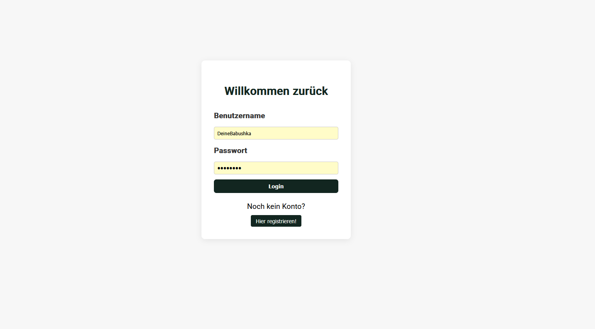
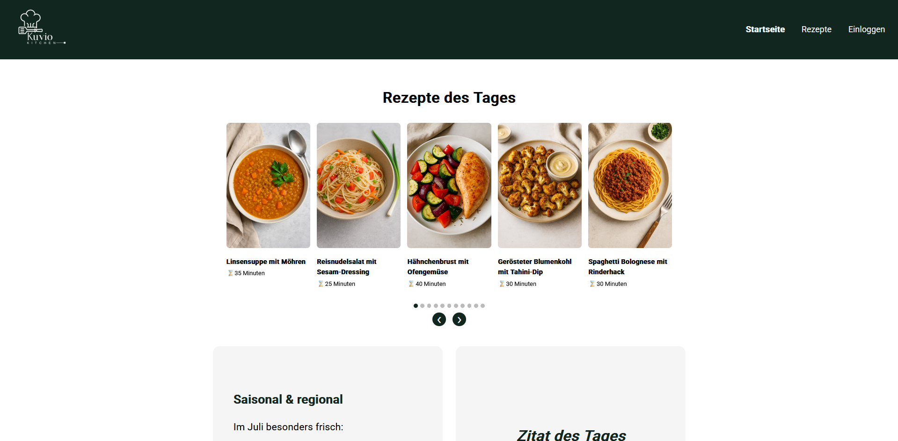
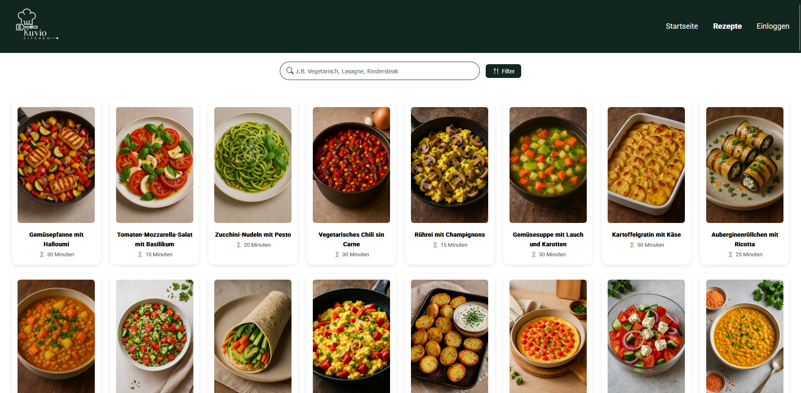
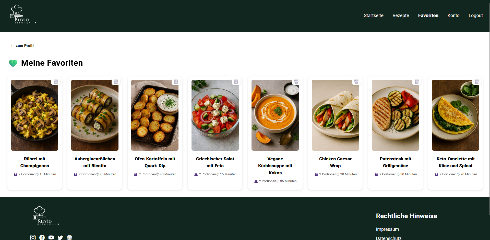
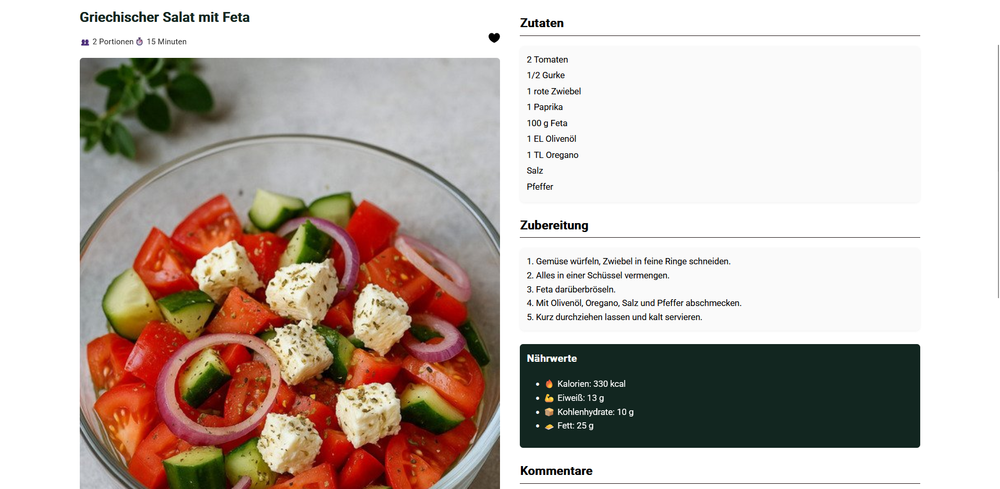
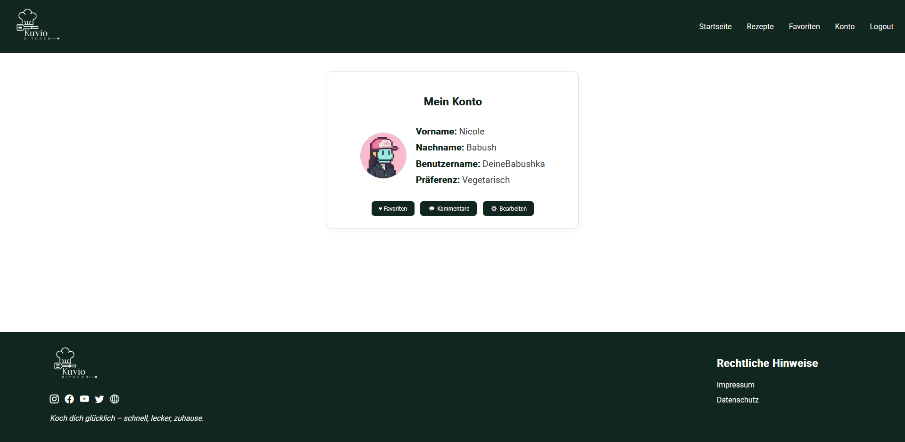
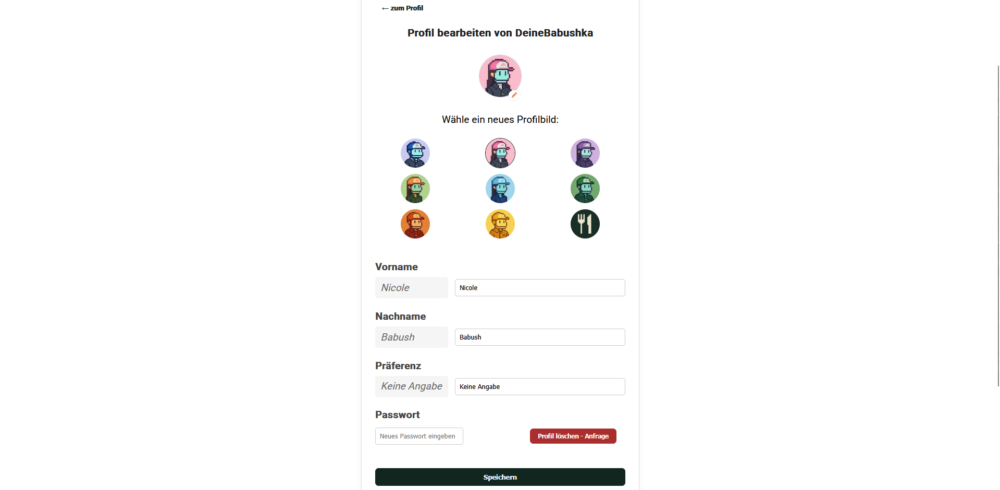
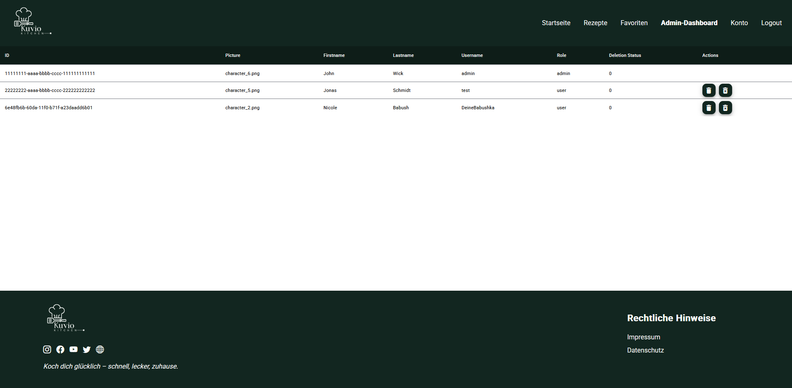

# Kuvio – Fullstack Web Application

A containerized recipe platform built with Angular, Node.js, MongoDB, and MariaDB. Developed as part of the "Fullstack Web Applications" course at Hochschule Worms in summer semester 2025.

---

## Badges


---

## Requirements

### Docker

- **Windows:** [Install Docker Desktop](https://docs.docker.com/desktop/setup/install/windows-install/)
- **Linux:**
  - [Install Docker](https://docs.docker.com/desktop/setup/install/linux/)
  - [Install Docker Compose plugin](https://docs.docker.com/compose/install/linux/)

### Git

- **Windows:** [Download Git](https://git-scm.com/downloads/win)
- **Linux:** [Download Git](https://git-scm.com/downloads/linux)

---

## Installation

1. Open your terminal or command line.
2. Ensure nothing is running on ports `4200`, `3000`, `27017`, or `3306`.
3. Make sure no existing Kuvio containers are running.
4. Clone the repository:

```bash
git clone https://gitlab.ai.it.hs-worms.de/fullstack-webapplications-sose-2025/group-n/kuvio-release
```

5. Navigate into the project folder:

```bash
cd kuvio-release
```

6. Start the application:

```bash
docker-compose up -d --build
```

7. Access the frontend at:

```
http://localhost:4200
```

---

## Default Credentials

### Admin

- **Username:** `admin`
- **Password:** `Test123321!`

### User

- **Username:** `test`
- **Password:** `Test123321!`

---

## Frontend Preview

### Login



### Home Page (Recipes of the Day)



### Recipe List + Search & Filter



### Favorites Page



### Single Recipe Detail View



### Profile Overview



### Profile Edit



### Admin Dashboard (User Management)



> All screenshots are located in the `screenshots/` folder and can be updated at any time.

---

## Removing Kuvio

To stop and remove containers:

```bash
docker-compose down -v
```

To delete all persisted user data:

```bash
rm -r *data
```

---

## Authors and License

This project was developed as part of the module *"Fullstack Web Applications"* at Hochschule Worms.

### Contributors

- me &
- Symeon Karagkiaouris  
- Maximilian Schneider  
- Valentin Pruin

License: [MIT](LICENSE)
